# Project Management Cheat Sheet

**Project management** is the practice of initiating, planning, executing, controlling, and closing the work 
of a team to achieve specific goals and meet specific success criteria at the specified time.

### Table of Contents

- [Introduction](#Introduction)
- [Knowledge Areas](#knowledge-areas)
  - [Integration](#integration)
  - [Scope](#scope)
  - [Time](#time)
  - [Cost](#cost)
  - [Quality](#quality)
  - [HR](#hr)
  - [Communications](#communications)
  - [Risk](#risk)
  - [Procurement](#procurement)
  - [Stakeholder](#stakeholder)
- [Resources](#resources)


## Introduction

**Project** - a unique and temporary endeavour that has a defined beginning and end, 
undertaken to create a specific product, service or result.

**Project Constraints** - limitations on what you do, how you do it and when you do it: 
  - Time constraint - time period within which you are to produce an end product or service. 
  - Money - amount of money and other resources allocated to your project. 
  - Scope - what the project accomplishes.
  
**Project Organizations**
  - Functional Organization - manager has responsibilities over specific function 
  (e.g. Marketing, Operations, Finance). Used for simple projects.
  - Matrix Organization
    - Weak - functional manager has more power and control than project manager
    - Balanced - functional manager and project manager both have power and control
    - Strong - project manager has more power than functional manager
  - Projectized Organization - project manager has all power and responsibilities. Team members are assigned to a single project. More expensive.
  
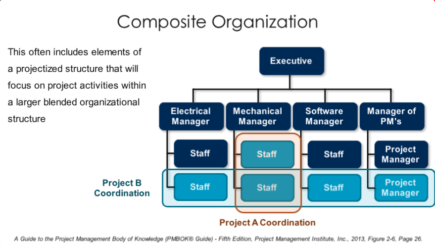

## Knowledge Areas

**PMBOK (Project Management Body of Knowledge)** has been developed by **PMI (Project Management Institute)** 
to promote generally recognized good practices in project management. 

PMBOK guide describes 10 **Project Management Knowledge Areas**:
  - Integration - processes and activities needed to coordinate other processes and activities whithin PM process groups
  - Scope - processes required to ensure that the project includes all the work required, 
  and only the work requred, the complete the project
  - Time - processes required to accomplish timely completion of the project
  - Cost - processes involved in planning, budgeting and controlling costs so that the project can be completed 
  within bidget
  - Quality - processes that determine quality policies so that the project will satisfy the needs for which 
  it was undertaken
  - HR - processes that organize and manage the project team
  - Communications - processes required for generation, collection and distribution of project information
  - Risk - processes concerned with conducting risk management
  - Procurement - processes to purchase or acquire products, services or results needed
  from outside the project team to perform the work
  - Stakeholder - processes to identify people, groups and organizations, that could impact or be impacted by the 
  project, to analyze stakeholder expectations and their impact on the project to develop appropriate strategies 
  for effectively engaging stakeholders in project execution.
  
PMBOK Introduction to Project Management Lesson 
https://s3-us-west-2.amazonaws.com/unex-pm-mooc/lesson01/story_html5.html

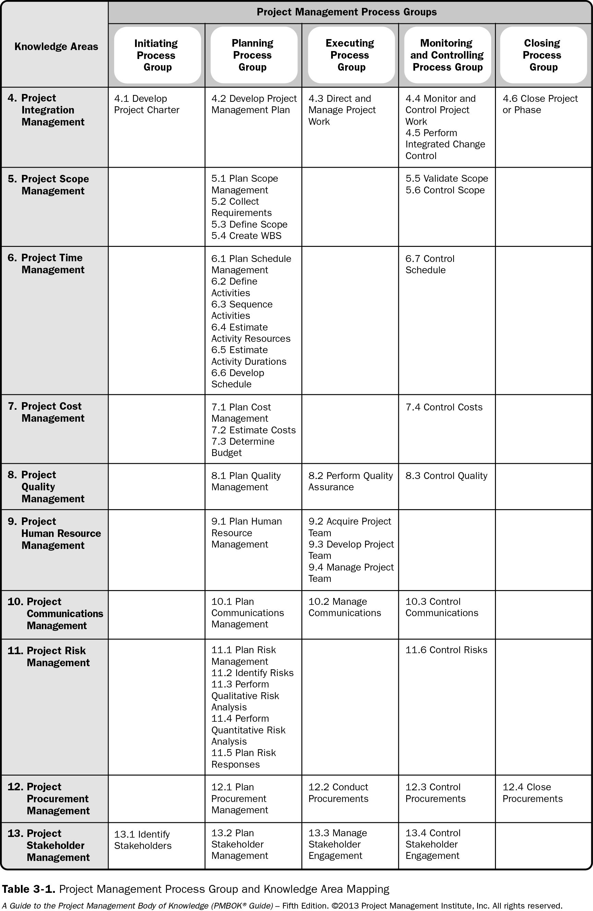

### Integration

PMBOK Project Integration Management Lesson 
https://s3-us-west-2.amazonaws.com/unex-pm-mooc/lesson11/story_html5.html

### Scope

**Project Charter** - the document that formally announces the project and grants the project manager the authority to 
use organizational resources to meet project objectives.

**Project Management Plan** should include:
  - Scope
    - what the project does accomplish and does not accomplish
    - Who approves this
    - Once approved, can it be changed?
  - Schedule
    - Are there guidelines
    - What software to be used
    - How often to be maintained
    - Who makes changes to it
  - Cost
    - Are there guidelines
    - Who approves the budget
    - What to do if you are under or over budget
    - Can you ask for more money and who do you ask
    - What type of budget reporting will you do
    
**WBS (Work Breakdown Structure)** - depicts the work that is necessary to meet project objectives. 
It is the foundational planning tool for the project. Based on the scope and helps to define the scope.

PMBOK Project Scope Management Lesson 
https://s3-us-west-2.amazonaws.com/unex-pm-mooc/lesson02/story_html5.html
  
### Time

Task Dependencies:
  - Mandatory
  - Discretionary
  - External
  
  - Finish to Start
  - Finish to Finish
  - Start to Start
  - Start to Finish
  
**Critical Path Method (CPA)** is an algorithm for scheduling a set of project activities:

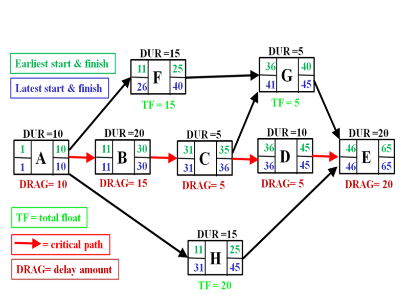
  

PMBOK Time Management Lesson
https://s3-us-west-2.amazonaws.com/unex-pm-mooc/lesson03/story_html5.html

### Cost

**Project Cost Management** includes the processes involved in planning, estimating, budgeting
and controlling costs so that the project can be completed within the approved budget.

Estimating Methodologies:
  - Top-Down Estimating
    - **Analogous Cost Estimating** - accomplished by analysing activities on past projects and using them as a basis
    for estimating costs. It's less costly, but less accurate.
    - **Parametric Estimating** - uses mathematical model to estimate costs (machine learning)
  - Bottom-Up Estimating - involves estimating the cost of individual tasks with the lowest level of detail.
  
Comparison of Cost Estimating Approaches:

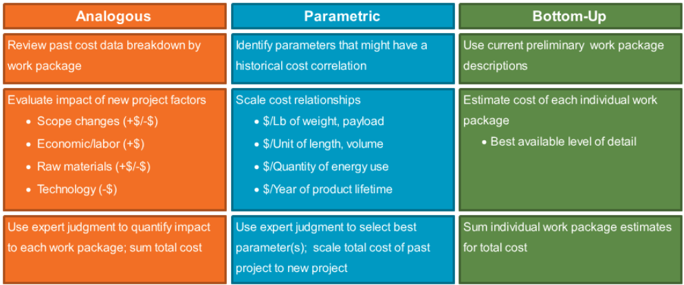

**Three-point estimation** - three figures are produced initially for every distribution that is required, 
based on prior experience or best-guesses:
  - a = the best-case estimate
  - m = the most likely estimate
  - b = the worst-case estimate
  
These values are used to calculate mean value for the estimate (E) and a standard deviation (SD), where:

```
E = (a + 4m + b) / 6
SD = (b − a) / 6
```

In Project Evaluation and Review Techniques (PERT) the three values are used to fit a PERT distribution 
for Monte Carlo simulations.

**Padding the Estimates** - the practice of overstating the estimates by team members to "hedge their bets".
This practice should be avoided, and a defined risk management process should be performed instead.

The **Cost Baseline Budget** is the approved and time-phased version of the budget, excluding management
reserves. 

The **Project Budget** is equal to the cost baseline budget plus management reserves.

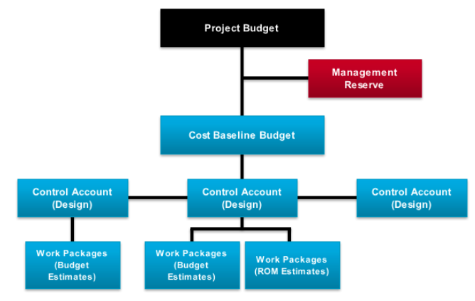

PMBOK Cost Management Lesson
https://s3-us-west-2.amazonaws.com/unex-pm-mooc/lesson04/story_html5.html

### Quality

**Prevention Over Inspection** -it is better to stop a defect from occurring. If you cannot do that, it is better to find the defect 
before your customer does and of course if your customer finds a defect, your quality process might not 
be working! 

**Plan Quality Management** - the process of identifying quality requirements and/or standards and
documenting how the project will demonstrate compliance. It should result in quality metrics, quality
checklists, process improvement plan.

**Product Quality** focuses on the goods and services. 
**Project Quality** focuses on the project management processes.

**Cost of Quality**:
  - **Cost of Conformance** - money spent during the project to avoid failures
    - Prevention Costs (Training, Documenting, Equipment, Time to do it right)
    - Inspection Costs (Testing, Inspections)
  - **Cost of Nonconformance** - moeny spent during and after the project because of failures
    - Internal Failure Cost (Bug fixing)
    - External Failure Cost (Liabilities, Warranty work, Lost business)
    
PMBOK Quality Management Lesson
https://s3-us-west-2.amazonaws.com/unex-pm-mooc/lesson05/story_html5.html

### HR

**Project Human Resource Management** includes the processes that organize, manage and lead the project team.

Skills related to human resource management:
  - Leading, communicating, negotiating, influencing, political astuteness and other key general management skills
  - Delegating, motivating, coaching, mentoring, and other subjects related to dealing with individuals
  - Team building, dealing with conflict, and other subjects related to dealing with groups
  - Performance appraisal, recruitment, retention, health and safety regulations, and other subjects related to 
  administering the human resource function.
  
A **Responsibility Assignment Matrix** (RAM) uses a matrix format to illustrate the connections between project
scope and the project team.

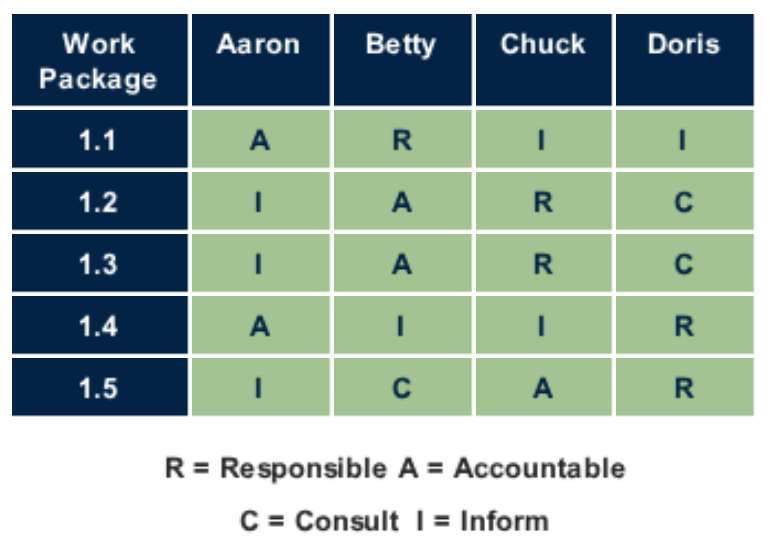

**The Tuckman Model**. The **forming–storming–norming–performing** model of group development was first proposed by 
Bruce Tuckman in 1965, who said that these phases are all necessary and inevitable in order for the team to grow, 
face up to challenges, tackle problems, find solutions, plan work, and deliver results.
  - **Forming** - is constituted of orientation, testing and dependence
  - **Storming** - characterized by conflict and polarization around interpersonal issues
  - **Norming** - in this stage in-group feeling and cohesiveness develop, new standards evolve, and new roles are 
  adopted. In the task realm, intimate, personal opinions are expressed. 
  - **Performing** - interpersonal structure becomes the tool of task activities. Roles become flexible and functional,
  and group energy is channeled into the task.
  
**Tools and Techniques to Manage Project Team**
  - **Observation and Conversation** - used to stay connected with the progress and attitudes of project team members
  (management-by-walking-around)
  - **Project Performance Appraisals** - clarification of roles and responsibilities, individual feedback & goal setting
  - **Conflict Management** - the foundation of conflict include shortage of resources, scheduling priorities, and
  interpersonal work approaches.
  - **Interpersonal Skills** - leadership, influence, and effective decision-making. 

Conflict resolution:
  - **Confronting** (problem solving or collaboration). Finds a solution that is best for the project, 
  but not necessarily best for one party or another.
  - **Compromising** - take ideas from each party so that the solution is a little bit of each. 
  May not necessarily result in the best approach.
  - **Smoothing** (accommodating) - you seek to remind the parties in conflict  of their similarities.
  - **Forcing** (competing) - you simply tell people how it will be.
  - **Avoiding** - good when you are outranked.

PMBOK HR Management Lesson
https://s3-us-west-2.amazonaws.com/unex-pm-mooc/lesson06/story_html5.html

### Communications

**Project Communications Management** includes the processes required to ensure timely and appropriate generation and 
distribution of project information.

A project manager spends **80-90%** of his time communicating. 

Effective project communications management **creates a bond between stakeholders**
based on a shared understanding of the project and the ongoing sharing of information needed for its success. Your 
**stakeholders will better understand** what is expected from them. **They will have more confidence** in you as a leader. 

The basic communications plan includes:

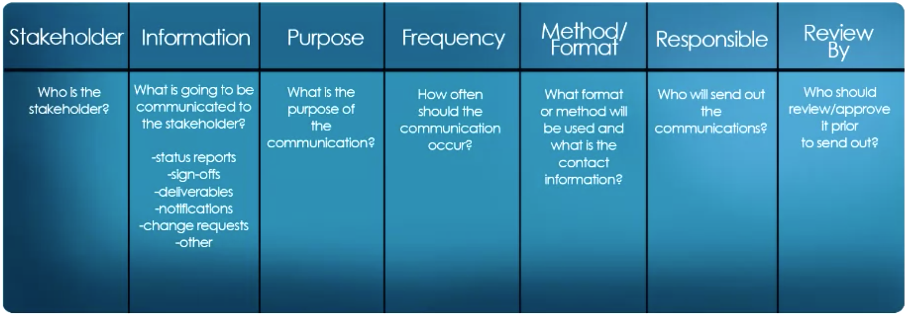

**Communication Skills**
  - Written and Oral
  - Listening and Speaking
  - Formal and Informal
  - Vertical and Horizontal
  - Internal and External
  
Communication Channels:

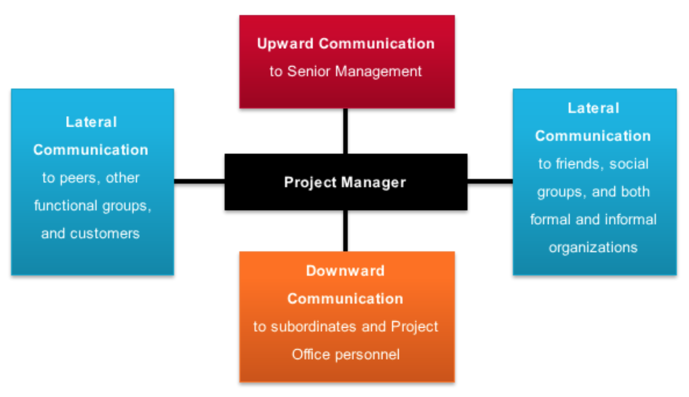

**Information Distribution Methods**:
  - Stand-up meetings
  - One-on-one meetings
  - E-mail
  - IM
  - Reports, Letters
  - Graphics

Status Report Template:

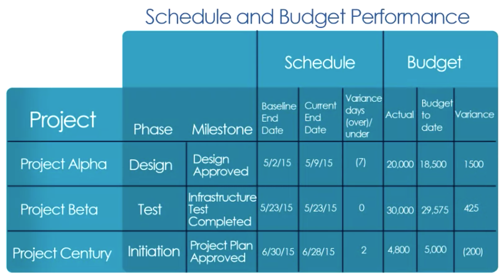

PMBOK Communications Management Lesson
https://s3-us-west-2.amazonaws.com/unex-pm-mooc/lesson07/story_html5.html

### Risk

**Project Risk Management** is a systematic practice that identifies, analyses, and responds to project risks. The
primary goal of project risk management is to minimise the likelihood and impact of negative events (threats).

Planning for risk begins with Murphy's Law - **if anything can go wrong, it will** - and continues with the Boy Scout 
motto: **be prepared**.

The elements of the risk management plan include:
  - Methodology - what approaches, tools and data sources will be used to manage risk on the project.
  - Roles and Responsibilities - who is on the risk management team? 
  - Budgeting - will funds be needed for **contingency and reserve funds**?
  - Timing - when and how often will risk management activities be performed, what part of it should go into the schedule?
  - Risk Categories - these are groupings of potential risks, meant to help you identify where risks may arise. 
  - Definitions of Probability and Impact - everyone should have the same understanding of e.g. what low probability for
  a risk means.
  
The key to project risk management is the identification of events that, if they happen, will affect the scope, schedule,
cost or quality objectives of the project. A simple **risk event statement** is as follows:

`If event "X" occurs, the project objective "Y" will be affected`

Information gathering techniques for risk identification:
  - Brainstorming
  - Interviews
  - **Delphi Method** - you ask for input from several experts/specialists - and you keep their identities anonymous. 
  A coordinator processes them and sends them to all the members for review. This creates an enriching feedback where the
  opinions of all the participants carry the same weight. 
  - Root cause analysis - identify a problem, discover the underlying causes that lead to it, and then develop a 
  preventive action.
  - Experts with relevant experience - such experts should be identified by the project manager and invited to consider
  all aspects of the project and suggest possible risks based on their previous experience and areas of expertise.
  
Risk Register Example:

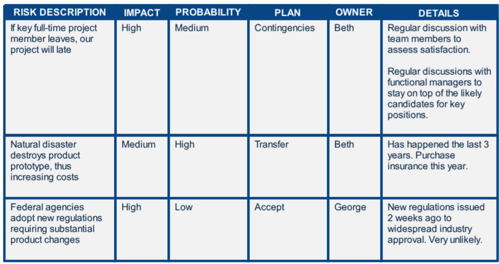

**Qualitative Risk Analysis** assesses the priority of identified risks using their **likelihood** of occurring and their 
corresponding **impact** on project objectives.    

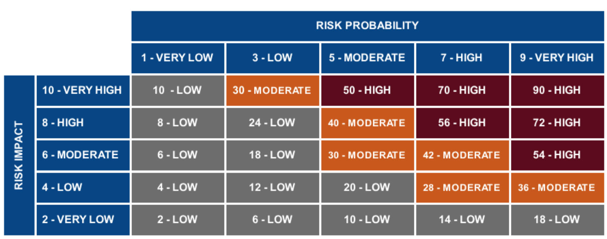

**Quantitative Risk Analysis** estimates, as objectively as possible, the numerical probabilities associated with 
the likelihood and numerical values associated with the impact of identified risks.

**Risk Response Strategies**:
  - **Avoid** - change scope, schedule or budget to avoid the risk
  - **Transfer** - shift the negative impact of a threat, along with ownership for the response, to a third party.
  E.g. insurance, performance bonds, warranties, guarantees, contracts.
  - **Mitigate** - reduce the probability and/or impact of an adverse risk event to an acceptable level. E.g. conducting 
  more tests, choosing a more stable supplier 
  - **Accept** - a contingency plan can be developed and an appropriate contingency reserve established. 

PMBOK Risk Management Lesson
https://s3-us-west-2.amazonaws.com/unex-pm-mooc/lesson08/story_html5.html

### Procurement

PMBOK Procurement Management Lesson
https://s3-us-west-2.amazonaws.com/unex-pm-mooc/lesson09/story_html5.html

### Stakeholder

**Stakeholder** - a person, group or organization who may affect, be affected by, or perceive itself to be 
affected by a decision, activity, or outcome of a project. Examples of stakeholders:
  - Team members
  - Customers
  - Sponsors
  - Vendors
  
Categorization of stakeholders:
  
|                  | **Low Interest**    | **High Interest** |
| ---              | ---                 | ---               |
| **Low Power**    | Monitor             | Keep Informed     |
| **High Power**   | Keep Satisfied      | Manage Closely    |

PMBOK Stakeholder Management Lesson https://s3-us-west-2.amazonaws.com/unex-pm-mooc/lesson10/story_html5.html

## Resources

- Initiating and Planning Projects https://www.coursera.org/learn/project-planning


